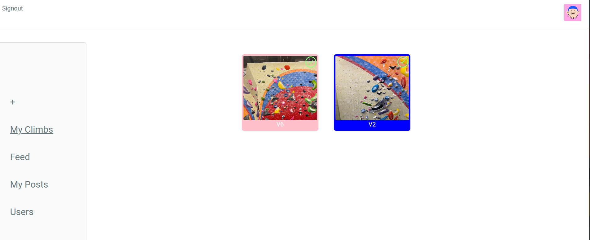
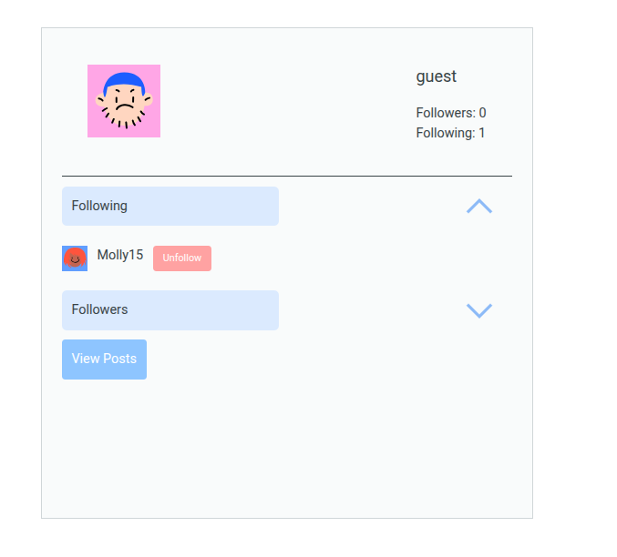
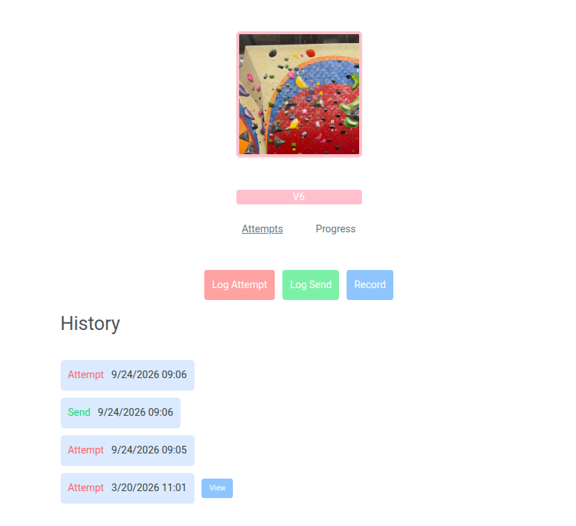
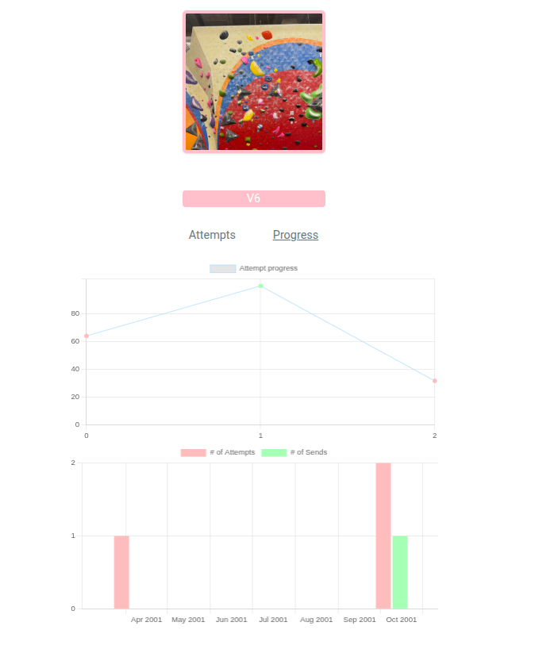
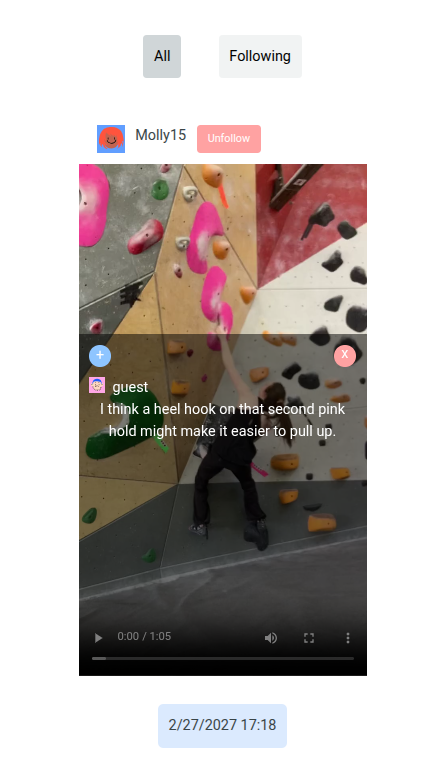

# Boulder Beta

A full-stack climbing tracker and social media platform to log climbs, track progress, and share beta with other climbers.

## Live

https://boulder-beta-1.onrender.com/

## Features

- Climb tracking: Add all of your current projects, track attempts/sends
- Climbing feed: Post videos of your attempts and sends and get advice from other climbers on beta
- Social Relationships: Follow your friends to stay up to date on their climbing progress
- Project analytics: View analytics to track progress on your projects over time

## Installation

- Clone repository with `git clone git@github.com:leah205/Boulder-Beta.git`
- for each of the `server` and `client` directories:
  - navigate to directory
  - run `npm install` to install dependencies
  - run `npm run dev` to start the development server

## Usage

### Configuring the environment

Add the following variables in the .env files in the client/ and server/ directories

Frontend:

- VITE_API_URL

Backend:

- DATABASE_URL
- CLOUDINARY_CLOUD_NAME=
- CLOUDINARY_API_KEY
- CLOUDINARY_API_SECRET
- CLOUDINARY_URL
- CLOUDINARY_FOLDER
- SECRET
- PORT

## Project Structure

Boulder-Beta/
├── client/ # React frontend
| ├── assets #image assets
| └── src #src code
├── server/ # Express backend
| └── src #src code
└── shared/ #shared types between front and backend

## Tech Stack

### Frontend

- React.js
- TailwindCSS
- React Query
- Vite
- vitest
- axios

### Backend

- Node.js
- Express
- Prisma
- PostgreSQL
- Passport.js
- multer
- vitest

## API Reference

All API routes are prefixed with `/api/v1`. Protected routes require an
`Authorization: Bearer <token>` header.

| Method   | Endpoint                           | Auth                        | Description                                                            |
| -------- | ---------------------------------- | --------------------------- | ---------------------------------------------------------------------- |
| `POST`   | `/auth/signup`                     | Public                      | Create a user account                                                  |
| `POST`   | `/auth/login`                      | Public                      | Authenticate a user and return a token                                 |
| `POST`   | `/auth/logout`                     | Bearer token                | Log out the authenticated user                                         |
| `GET`    | `/auth/userFromToken`              | Bearer token                | Get the authenticated user                                             |
| `POST`   | `/climbs`                          | Bearer token                | Create a climb; accepts an optional `picture` upload                   |
| `GET`    | `/climbs/:climb_id`                | Bearer token, climb owner   | Get a climb                                                            |
| `GET`    | `/climbs/:climb_id/attempts`       | Bearer token, climb owner   | List attempts for a climb                                              |
| `POST`   | `/climbs/:climb_id/attempts`       | Bearer token, climb owner   | Create an attempt; accepts an optional `clip` upload                   |
| `POST`   | `/attempts/:climb_id`              | Bearer token, climb owner   | Create an attempt; accepts an optional `clip` upload                   |
| `GET`    | `/attempts/:attempt_id/video`      | Bearer token, attempt owner | Get an attempt video                                                   |
| `POST`   | `/attempts/:attempt_id/video/post` | Bearer token, attempt owner | Publish an attempt video as a post                                     |
| `GET`    | `/users`                           | Bearer token                | List users                                                             |
| `GET`    | `/users/me/climbs`                 | Bearer token                | List the authenticated user's climbs                                   |
| `POST`   | `/users/me/following/follow`       | Bearer token                | Follow a user                                                          |
| `POST`   | `/users/me/following/unfollow`     | Bearer token                | Unfollow a user                                                        |
| `GET`    | `/users/:id`                       | Bearer token                | Get a user's profile                                                   |
| `GET`    | `/users/:id/posts`                 | Bearer token                | List a user's posts                                                    |
| `GET`    | `/users/:id/following`             | Bearer token                | List a user's following relationships                                  |
| `GET`    | `/posts`                           | Bearer token                | Get the main feed; supports `cursor` and `limit` query parameters      |
| `GET`    | `/posts/following`                 | Bearer token                | Get the following feed; supports `cursor` and `limit` query parameters |
| `GET`    | `/posts/:id`                       | Bearer token                | Get a post                                                             |
| `DELETE` | `/posts/:id`                       | Bearer token, post owner    | Delete a post                                                          |
| `GET`    | `/posts/:id/claps`                 | Bearer token, post owner    | List claps for a post                                                  |
| `POST`   | `/posts/:post_id/betas`            | Bearer token                | Add beta to a post                                                     |
| `POST`   | `/posts/:post_id/clap`             | Bearer token                | Clap a post                                                            |
| `POST`   | `/posts/:post_id/unclap`           | Bearer token                | Remove a clap from a post                                              |

## Screenshots

